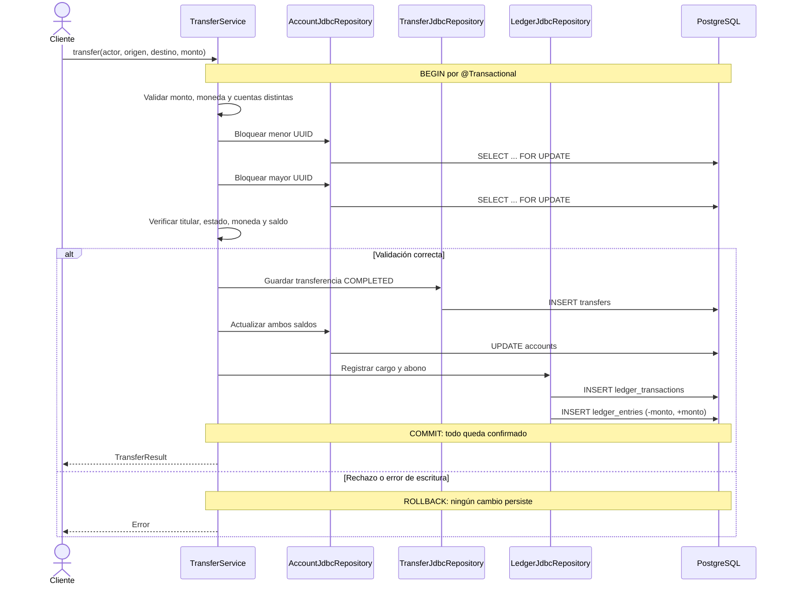

# Flujo de una transferencia interna

`Transfer` registra la operación de negocio. `Account` guarda el saldo disponible para consultas rápidas. `Ledger` registra los movimientos contables que explican ese cambio: un cargo negativo al origen y un abono positivo al destino.

## Por qué se hace así

- `SELECT ... FOR UPDATE` impide que dos transferencias gasten simultáneamente el mismo saldo. Las cuentas se bloquean siempre en el mismo orden para reducir deadlocks.
- Los saldos y el ledger se escriben dentro de **una sola transacción SQL**. Si falla un asiento, se revierten también la transferencia y ambos saldos.
- Los dos asientos de una transferencia se compensan: `-monto + monto = 0`.
- `Account.available_balance` es una proyección de lectura rápida. El ledger conserva la historia que permitirá reconstruirla y reconciliarla.

Esta versión es un servicio interno. Todavía faltan la idempotencia, la autenticación y el endpoint HTTP.
