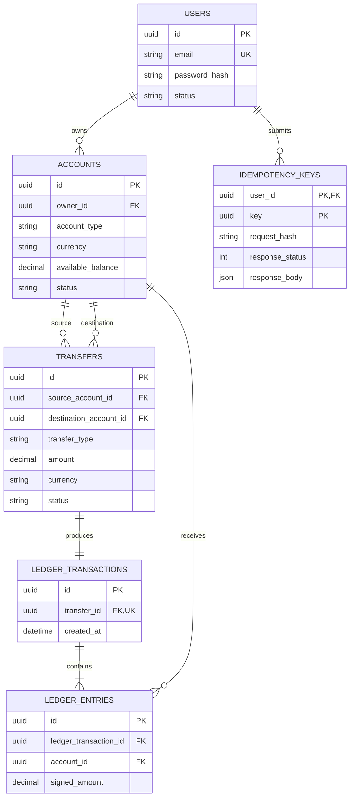

# Modelo de datos — decisiones de fase 0

Este es el diseño objetivo de la primera versión. Las migraciones SQL concretarán nombres de índices y claves foráneas al implementar el core.

## Dinero y ledger

- PostgreSQL usa `NUMERIC(19,2)` para importes y saldos; Java usará `BigDecimal` con escala 2. La API recibe importes como **cadenas** de dos decimales, por ejemplo `"150.00"`, para evitar la conversión a números binarios de punto flotante en clientes.
- Cada `ledger_entry.signed_amount` es distinto de cero. Un cargo a origen es negativo y un abono a destino es positivo. Para una operación, `SUM(signed_amount) = 0`.
- Cada movimiento confirmado crea una fila en `ledger_transactions` y exactamente dos entradas en la primera versión. `ledger_transactions.transfer_id` es único.
- `accounts.available_balance` es una proyección actualizada dentro de la misma transacción SQL que crea los asientos. Una reconciliación comparará esa proyección con la suma del ledger.
- El balance de un conjunto de filas no se puede garantizar con un `CHECK` de una sola fila. El caso de uso lo comprobará antes del commit y una prueba de integración verificará el invariante. La protección mediante trigger diferido queda como mejora futura.

## Depósitos simulados

- Existirá una cuenta interna `SYSTEM` en PEN, sin `owner_id`, creada por migración/seed. Solo una cuenta `SYSTEM` por moneda.
- Un depósito de prueba se guarda como `transfer_type = TEST_DEPOSIT`, con origen `SYSTEM` y destino la cuenta del usuario. Produce los mismos dos asientos que una transferencia interna.
- La cuenta `SYSTEM` puede tener saldo negativo: representa la contrapartida de fondos simulados emitidos. Las cuentas `USER` nunca pueden tener saldo negativo.
- El endpoint de depósitos será administrativo y se definirá cuando se implemente; la API pública de transferencias solo acepta cuentas `USER`.

## Estados y restricciones

- El MVP procesa transferencias de forma síncrona. Solo persiste `status = COMPLETED` tras un commit exitoso. Los rechazos no crean transferencias; la respuesta del rechazo puede guardarse en `idempotency_keys`.
- `transfers.amount > 0`, `source_account_id <> destination_account_id`, moneda `PEN` y tipo en `INTERNAL_TRANSFER | TEST_DEPOSIT`.
- `accounts.account_type` está limitado a `USER | SYSTEM`; `owner_id` es obligatorio solo para `USER`. Para `USER`, `available_balance >= 0`.
- Las claves de idempotencia son únicas por `(user_id, key)`. El email de usuario es único sin distinguir mayúsculas de minúsculas.
- Las tablas de ledger son append-only para la aplicación: no se exponen operaciones de edición o borrado. La restricción mediante permisos o triggers se decidirá al escribir las migraciones.

Restricciones SQL prioritarias: `CHECK (amount > 0)`, `CHECK (source_account_id <> destination_account_id)`, `CHECK (account_type = 'SYSTEM' OR available_balance >= 0)`, clave única de `ledger_transactions.transfer_id`, índice único sobre `lower(users.email)` e índice único parcial sobre `accounts(currency)` cuando `account_type = 'SYSTEM'`. Las claves foráneas deben impedir borrar cuentas o transferencias que ya tengan historia contable.

## Idempotencia transaccional

- `Idempotency-Key` es un UUID generado por el cliente. La huella SHA-256 se calcula sobre usuario y campos normalizados de la solicitud.
- La reserva de la clave, el movimiento financiero y la respuesta final se guardan en **una misma transacción SQL**. Si ocurre rollback, tampoco queda reservada la clave.
- Dos solicitudes simultáneas con la misma clave compiten por la restricción única: la segunda espera el resultado de la primera y devuelve la respuesta guardada, o recibe `409` si la huella difiere.
- Se guardan respuestas definitivas de negocio, incluidas las de saldo insuficiente. Un error transitorio de servidor provoca rollback y puede reintentarse.
- En el MVP las claves no expiran. Así, una repetición tardía tampoco vuelve a mover dinero. Se revisará la retención si el volumen de datos lo exige.

## Concurrencia

Dentro de la transacción, bloquear ambas cuentas con `SELECT ... FOR UPDATE` **una por una, en orden ascendente de UUID**. Después de obtener los bloqueos, validar estado, titularidad, moneda y saldo; escribir transferencia, asientos y saldos; finalizar la respuesta idempotente; confirmar. Los depósitos administrativos seguirán la misma regla de bloqueo.
