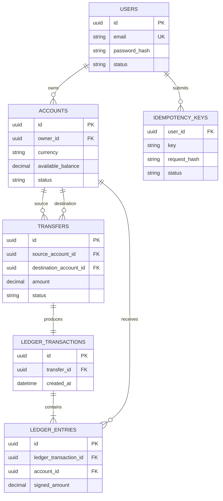

# Modelo de datos inicial

Este esquema sirve para discutir las relaciones antes de escribir migraciones. Las columnas y restricciones finales se definirán al implementar cada módulo.

## Decisiones por cerrar

- Representación monetaria: `NUMERIC` con escala fija o unidades menores enteras.
- Cómo asociar depósitos de prueba a su cuenta interna de contrapartida.
- Restricciones SQL que garanticen unicidad y estados válidos.
- Política de retención de claves de idempotencia.
